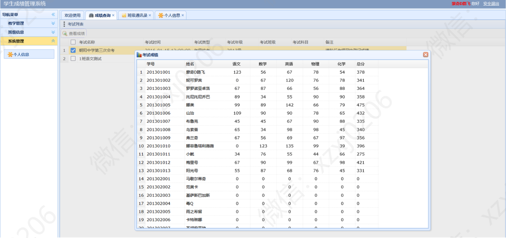
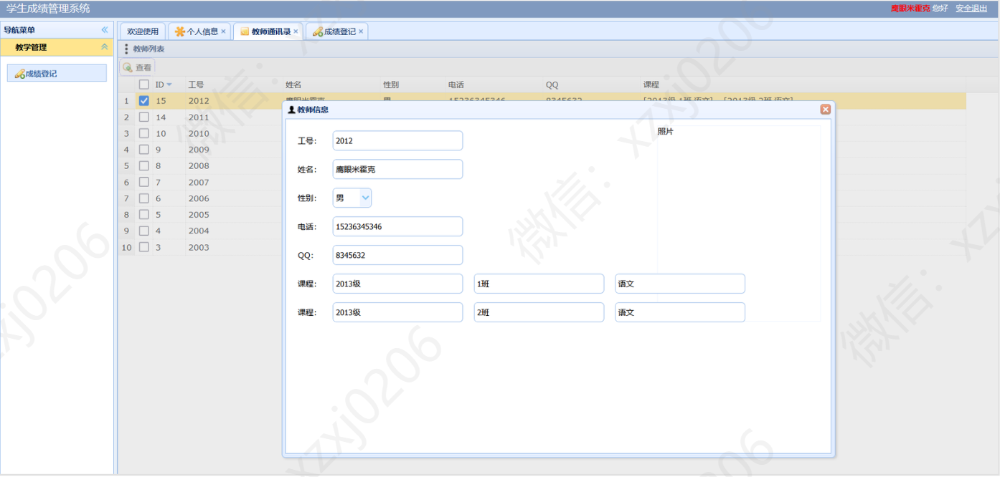

# 学生信息管理系统

### 有问题，或者需要协助调试运行项目的, 可以+扣扣：2529519551，或者+ wx ：xzxj0206  注明项目，“git+项目名称” ，如：“git学生宿舍管理系统”

# 项目介绍
该学生信息管理系统涉及到学生、教师、系统管理员、班级、学生成绩、课程等。

# 系统运行界面

## 一、技术栈

编程语言：Java+Jsp

技术栈：Servlet+Jsp+Jdbc+EasyUI+jQuery+Ajax+面向接口编程

## 二、项目功能介绍

用户角色：学生、教师、系统管理员，可以查看班级其他同学的信息(可以看成是班级的同学录)。

管理员可对学生、老师、班级、课程进行设置；管理员为班级设置年级，为年级设置课程，为班级的每门课程设置老师，为学生设置班级。

学生查看成绩、查看和修改自己的信息；

老师对自己课程的学生设置课程成绩、查看和修改自己的信息，查看学生的信息和成绩、以及统计分析学生的成绩；

(一)、管理员功能菜单
1、学生信息管理
    学生列表
2、教师信息管理
    教师列表
3、班级信息管理
    班级列表
    年级列表
4、课程信息管理
    课程列表
    成绩统计分析
    考试列表
5、系统管理
6、系统设置

(二)、学生功能菜单
1、班级信息
    班级通讯录
2、教学管理
    成绩查询
3、信息管理
    个人信息
    修改密码

(三)、教师功能菜单
1、教师信息
    教师通讯录
2、教学管理
    成绩登记
    考试统计
3、信息管理
    个人信息
    修改密码

## 三、学生功能部分页面展示

## 四、教师功能部分页面展示

## 五、管理员部分功能页面展示

